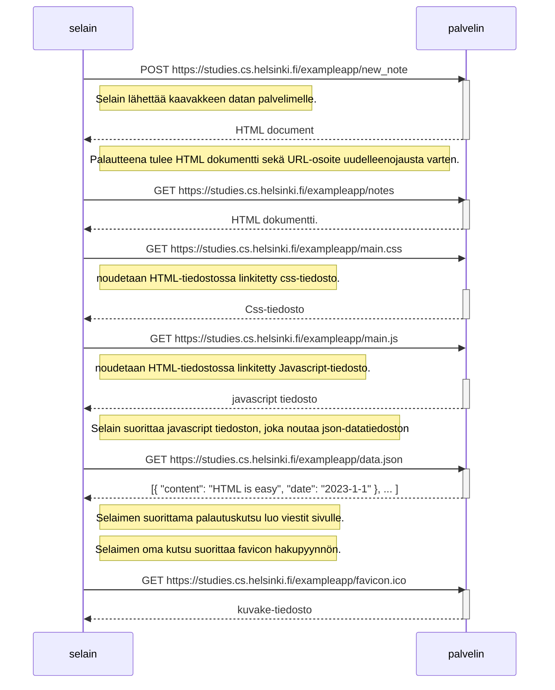

```mermaid
sequenceDiagram
    participant selain
    participant palvelin

    selain->>palvelin: POST https://studies.cs.helsinki.fi/exampleapp/new_note
    activate palvelin
    Note right of selain: Selain lähettää kaavakkeen datan palvelimelle.
    palvelin-->>selain: HTML document
    deactivate palvelin

    Note left of palvelin:  Palautteena tulee HTML dokumentti sekä URL-osoite uudelleenojausta varten.

    selain->>palvelin: GET https://studies.cs.helsinki.fi/exampleapp/notes
    activate palvelin
    palvelin-->>selain: HTML dokumentti.
    deactivate palvelin

    selain->>palvelin: GET https://studies.cs.helsinki.fi/exampleapp/main.css
    Note right of selain: noudetaan HTML-tiedostossa linkitetty css-tiedosto.
    activate palvelin
    palvelin-->>selain: Css-tiedosto
    deactivate palvelin

    selain->>palvelin: GET https://studies.cs.helsinki.fi/exampleapp/main.js
    Note right of selain: noudetaan HTML-tiedostossa linkitetty Javascript-tiedosto.
    activate palvelin
    palvelin-->>selain: javascript tiedosto
    deactivate palvelin

    Note right of selain: Selain suorittaa javascript tiedoston, joka noutaa json-datatiedoston

    selain->>palvelin: GET https://studies.cs.helsinki.fi/exampleapp/data.json
    activate palvelin
    palvelin-->>selain: [{ "content": "HTML is easy", "date": "2023-1-1" }, ... ]
    deactivate palvelin

    Note right of selain: Selaimen suorittama palautuskutsu luo viestit sivulle.

    Note right of selain: Selaimen oma kutsu suorittaa favicon hakupyynnön.
    selain->>palvelin: GET https://studies.cs.helsinki.fi/exampleapp/favicon.ico
    activate palvelin
    palvelin-->>selain: kuvake-tiedosto
    deactivate palvelin
```
