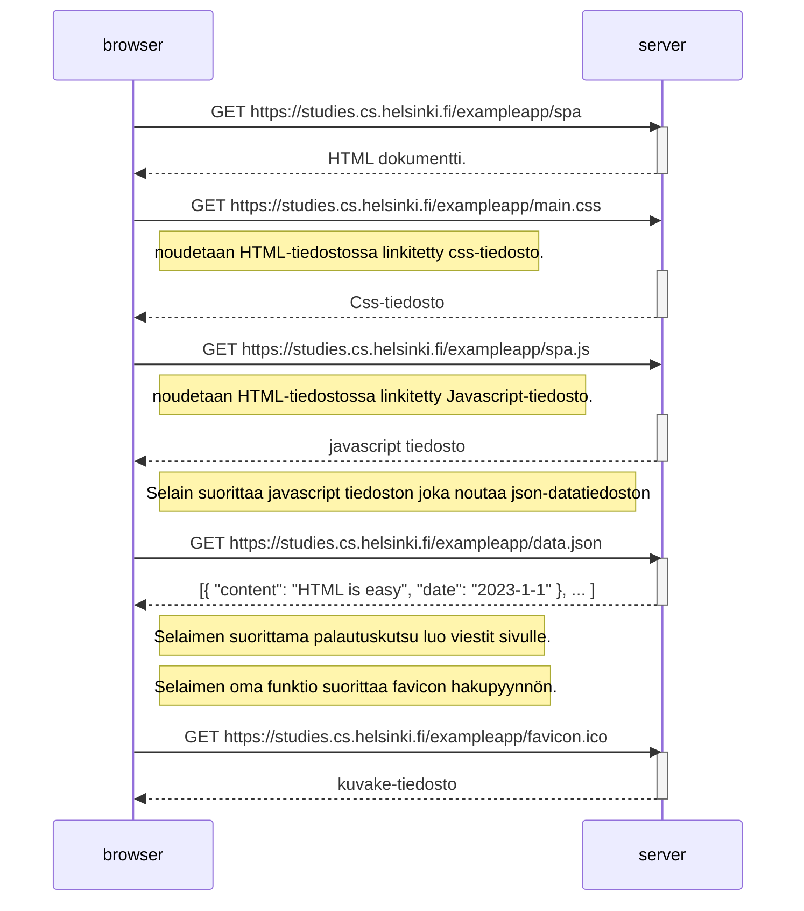

```mermaid
sequenceDiagram
    participant browser
    participant server

    browser->>server: GET https://studies.cs.helsinki.fi/exampleapp/spa
    activate server
    server-->>browser: HTML dokumentti.
    deactivate server

    browser->>server: GET https://studies.cs.helsinki.fi/exampleapp/main.css
    Note right of browser: noudetaan HTML-tiedostossa linkitetty css-tiedosto.
    activate server
    server-->>browser: Css-tiedosto
    deactivate server

    browser->>server: GET https://studies.cs.helsinki.fi/exampleapp/spa.js
    Note right of browser: noudetaan HTML-tiedostossa linkitetty Javascript-tiedosto.
    activate server
    server-->>browser: javascript tiedosto
    deactivate server

    Note right of browser: Selain suorittaa javascript tiedoston joka noutaa json-datatiedoston

    browser->>server: GET https://studies.cs.helsinki.fi/exampleapp/data.json
    activate server
    server-->>browser: [{ "content": "HTML is easy", "date": "2023-1-1" }, ... ]
    deactivate server

    Note right of browser: Selaimen suorittama palautuskutsu luo viestit sivulle.

    Note right of browser: Selaimen oma funktio suorittaa favicon hakupyynnön.
    browser->>server: GET https://studies.cs.helsinki.fi/exampleapp/favicon.ico
    activate server
    server-->>browser: kuvake-tiedosto
    deactivate server
```
